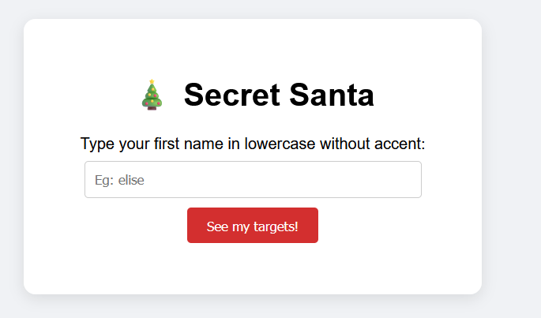
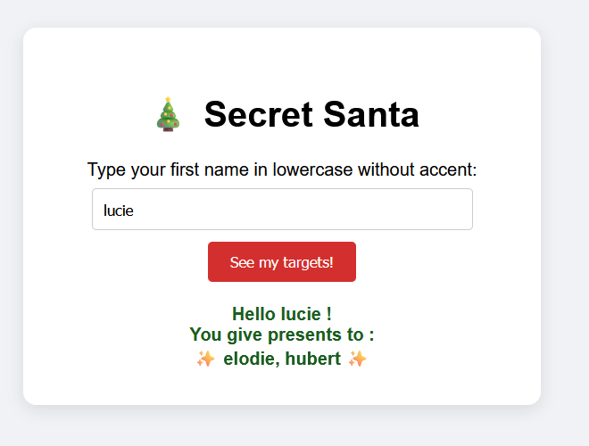

# Advanced constrained secret Santa generator

## Introduction

We organize Secret Santa every year in my family.

The simplest way to do it is to have each participant randomly draw another participant's name, but it's not necessarily the most practical.

For example, if a participant draws their own name, they'll have to draw again. And if, in the end, only one slip of paper with their name left, then another draw has to be organized.

### Basic constraints

It turns out that the most fun draws aren't the perfectly random ones, but that some constraints are still necessary:

- You obviously can't draw your own name.
- If you live under the same roof as another participant, they'll probably ask you who your target is. Therefore, you shouldn't be able to draw the name of someone who lives with you. A group of participants who live together are called "atomic sub-families."

We would also like to avoid closed cycles that are too short, for example alice :gift: :arrow_right: elodie and elodie :gift: :arrow_right: alice. We will therefore seek to form closed Hamiltonian cycles.

### Inattentive participants

An additional problem arises when Secret Santa participants are not paying attention: a participant risks ending up without a gift! :worried:

To overcome this problem, the best solution is for each participant to give and receive two gifts. This way, each participant is guaranteed to receive at least one gift, and the distracted participant who forgot the gift can always lie by claiming to have given a shared gift with their counterpart.

We then seek to construct a second closed Hamiltonian cycle. Two constraints then appear:

- The two cycles must not lead a participant to give two gifts to the same person (for example, Alice :gift: :arrow_right: Elodie, Elodie).

- We still aim to avoid overly short closed cycles, such as **Alice** :gift: :arrow_right: **Elodie**, Kevin and **Elodie** :gift: :arrow_right: Didier, **Alice**.

In other words, we are looking for **two completely disjoint Hamiltonian cycles on the undirected attribution graph**.


## Features

This program allows you to generate Secret Santa assignments with the following features:
- Each participant give and receive `n_gifts` gifts (configurable).
- Participants from the same family (atomic sub-family) cannot give gifts to each other.
- Participants cannot give gifts to participants they gave gifts to in the previous year.
- The program ensures that the assignments form disjoint Hamiltonian cycles, avoiding short closed cycles.
- Optionally generates a responsive HTML page that you can host on your personal server, for participants to view their assigned targets.

## Installation

To compile this project, first install the Rust toolchain from [the official website](https://rust-lang.org/tools/install/).

Follow the instructions there to set up Rust and Cargo on your system.

Then, clone this repository and navigate to its directory:

```bash
git clone https://github.com/thomasarmel/advanced_constrained_secret_santa.git
cd advanced_constrained_secret_santa
```

Finally, build the project using Cargo:

```bash
cargo build --release
```

The executable will be located in the `target/release` subdirectory.

## Usage

### Configuration

First prepare a config JSON5 file describing the participants and constraints.
We provide an example config file in [example_config.json5](example_config.json5).

Here is the schema of the JSON5 config file:

- **n_gifts** *(integer)*
    The number of gifts each participant should give and receiver.
- **participants** *(array of objects)*
    An array of participant objects, each containing:
    - **name** *(string)*
        The name of the participant (**must be unique**).
    - **family** *(integer)*
        Family identifier to group participants from the same family. A participant cannot give a gift to another participant from the same family.
    - **last_year_targets** *(array of strings)*
        A list of names of participants who received gifts from this participant in the previous year. A participant cannot give a gift to anyone in this list.

### Running the program

To run the program, use the following command:

```bash
cargo run --release -- <path_to_json5_config_file>
```

This will output the assignment of targets for each participant in the terminal.

### Generating a HTML page for participants

Optionally you can generate a HTML page that will allow each participant to see their assigned targets. To do so, add the `--to-html` argument:

```bash
cargo run --release -- <path_to_json5_config_file> --to-html
```

This will generate a `santa_results.html` file in the current directory.

The web page should be responsive.

You can host it on your server, and share the link with the participants.

Each participant can then enter their name to see their assigned targets:



After entering their name, the participant will see their assigned targets:



<details>
<summary>For the administrator</summary>

You can type "`perenoel`" as the name to see the full assignment of all participants.
</details>